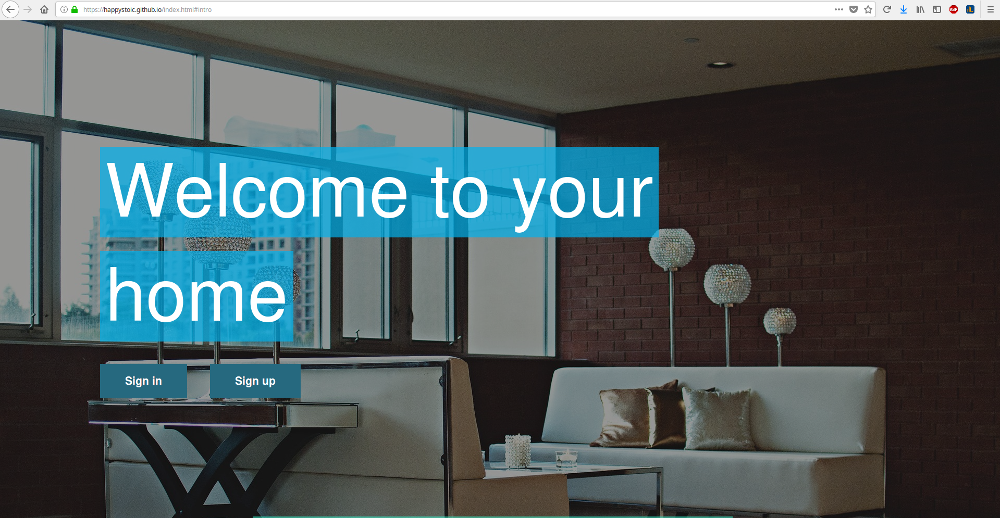
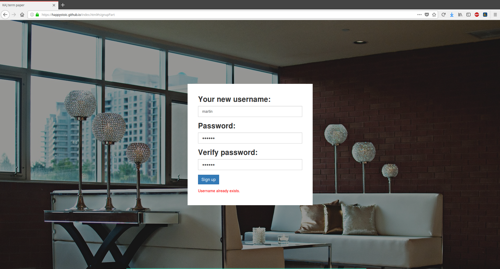
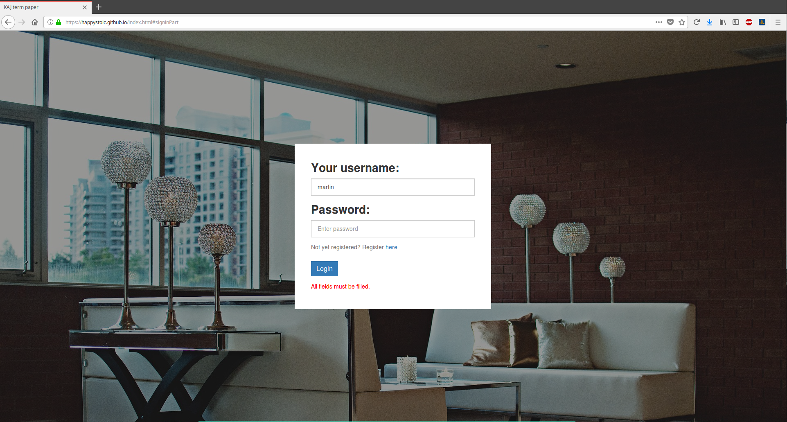
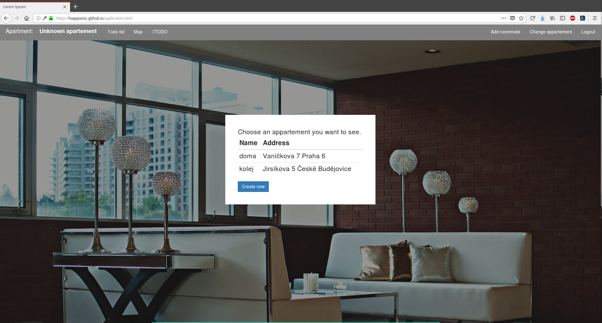
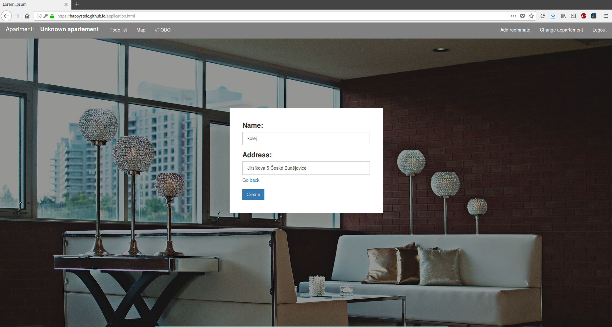
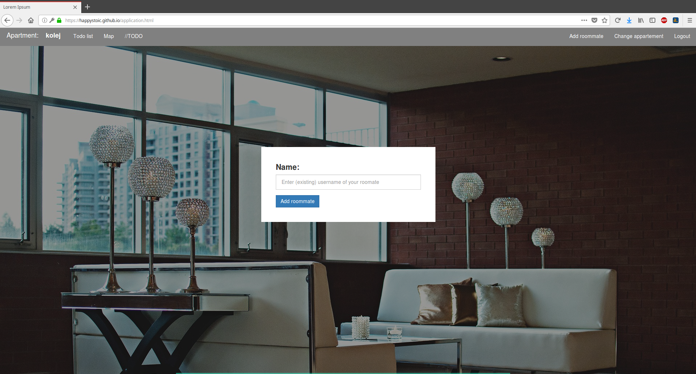
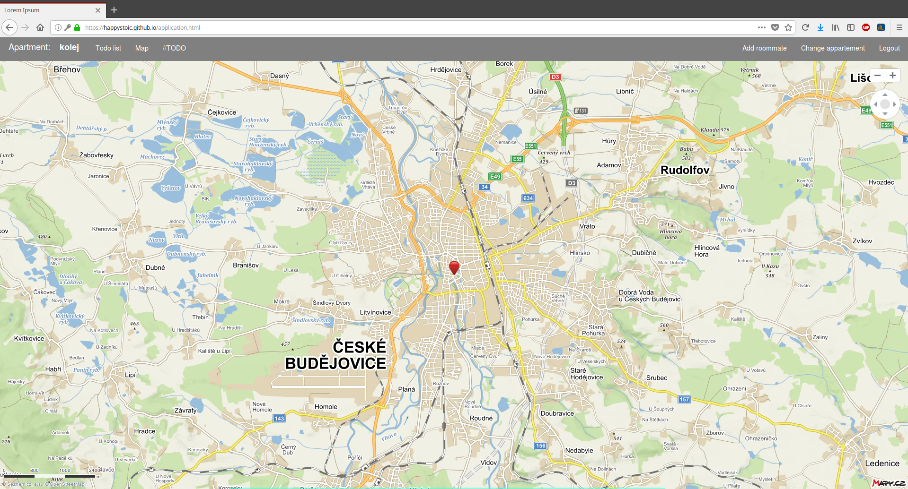
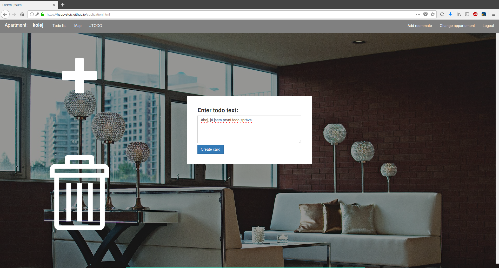
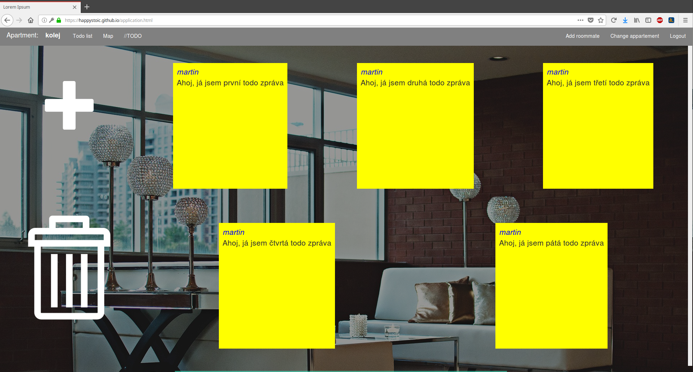

# Documentation

## Project Structure + information
Project consists of 2 pages - [index.html](../index.html) (intro, signing in, signing up) and [application.html](../application.html) with the whole functionality.
Signing is provided beacuse of fake database which is using localStorage (more precisely stringlify with localStorage) to store all the data.

#### Functionality
For now user is able to register and log in. While you're logged in you can create new apartments (with its own name and address) under your login. After that you can decide what apartment you want to adjust (if there are more apartments linked with you). 

You can see it on the map (you see the address provided during creation of the apartment or center of Prague if address is invalid) or create todo cards to this apartment. You can also add another user (this user must already exists) to your apartment. It means when he logs in, he can see all todo cards created in the past in this apartment. To remove todo card it needs to be dragged to the svg litter bin on the left side.

### Styles
* [index.html](../index.html) has style in [scss](../scss)/[index.scss](../scss/index.scss)
* [application.html](../application.html) has style in [scss](../scss)/[application.scss](../scss/application.scss)
* Background images are storred in /[resources](../resources) folder

Both files are compiled with dependencies to its own .css file in /[scss](../scss)/[dist](../scss/dist) folder

### Javascript
Javascript files are stored in /[js](../js/) folder

* [index.html](../index.html) uses /[js](../js/)/[index.js](../js/index.js)
* [application.html](../application.html) uses all files in [js](../js/)/[application](../js/application) folder
* Code is written in ES6 and afterwards transpiled to the ES5 by babelify
* All javascript for one webpage is compiled to a single js file in /[js](../js/)/[dist](../js/dist) folder
* [js](../js/)/[application](../js/application) - source code of these files is also commented
    * `apartementsControl.js`Selecting current apartment and creating new ones 
    * `application.js` Javascript not so unique to have its own file - e.g. eventListeners on body etc.
    * `map.js` Asynchronous loading maps via [Seznam mapy api](https://api.mapy.cz/) 
    * `navigation.js` With everything clickable on the top navigation bar is dealt here. 
    * `roommateInvite.js`Javascript to add roommate (already existing user) to your apartment
    * `todoList.js` Dealing with todo cards (showing, creating, dragNdrop)
    

## User guide
How it actually works and looks like:

Welcoming page

 
 

Signing in form.

 

First you need to choose your apartment (or create a new one - next image). Otherwise you will be allowed to use only map.

 

You can also create new apartments. Names must be again unique.

 

If you have apartment selected you can add your roommate into it.

 

Application provides you map to see precise location of selected apartment (or Prague if address is invalid)

 

With click on svg plus icon on the left you can add todo cards under selected apartment.

 

To remove created todo cards you need to drag them and drop them to the litter bin on the left.

 

